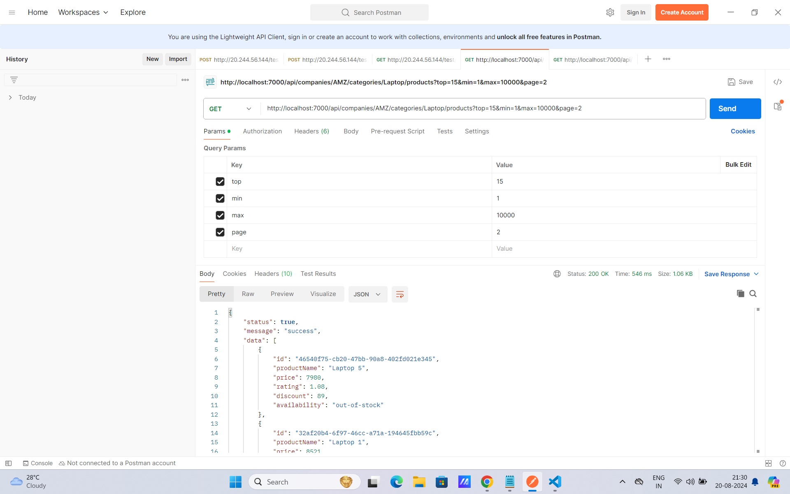
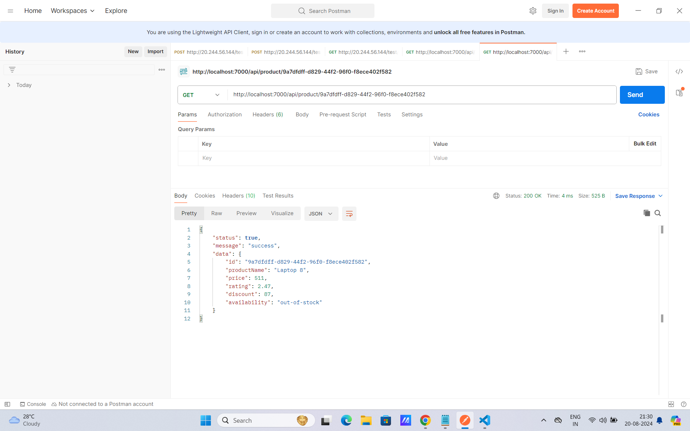
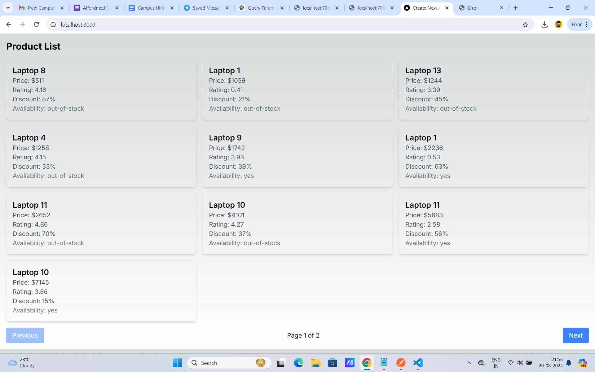

# Readme

[Backend API Call 2](backend2.png)

This readme file contains images showcasing the backend API calls and the frontend.
This readme file contains images showcasing the backend API calls.